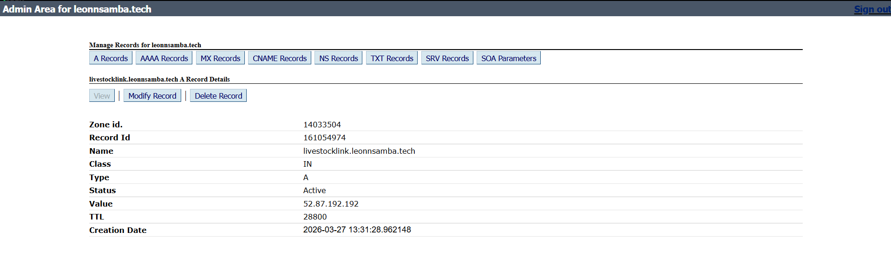
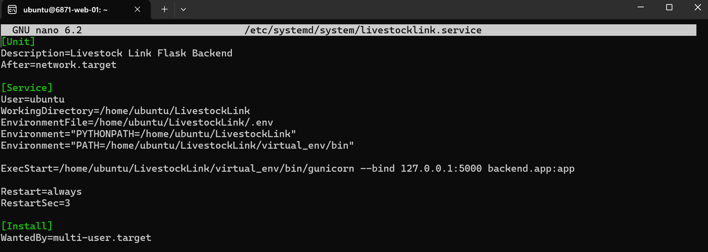
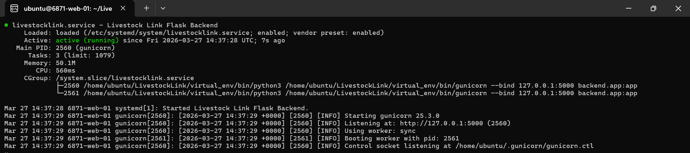
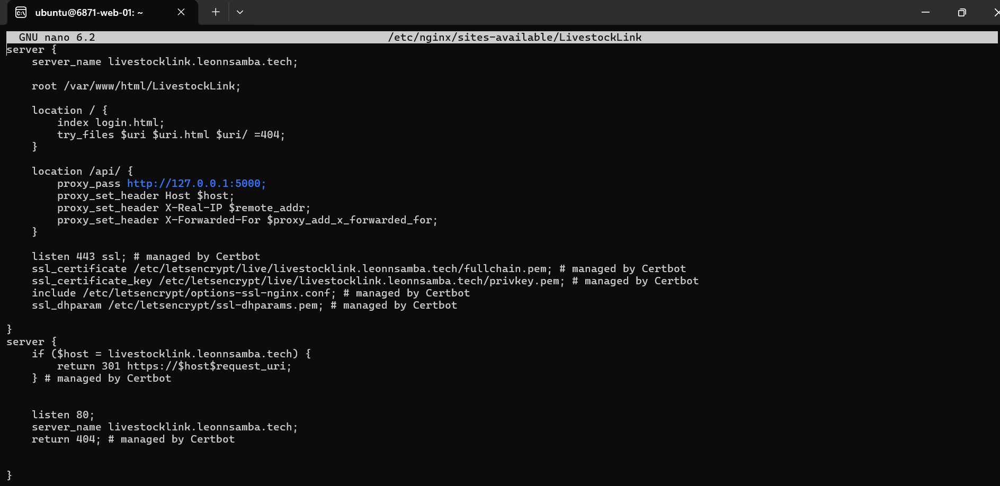

<h1 align="center"> 📝 LIVESTOCK LINK - DEPLOYMENT GUIDE </h1>

**Live URL:** https://livestocklink.leonnsamba.tech

---

## Infrastructure Overview

| Component | Technology |
|-----------|------------|
| Web Server | Nginx 1.18 |
| WSGI Server | Gunicorn |
| Backend | Flask (Python) |
| Database | MySQL via Aiven Cloud |
| SSL | Let's Encrypt (Certbot) |
| OS | Ubuntu 24 (AWS EC2) |

---

## 1. DNS Configuration

In your DNS management panel create a new A Record:

- **Name:** `livestocklink`
- **Destination IP:** your server IP
- **Status:** Active



---

## 2. Server Setup

SSH into your server and clone the repository:
```bash
ssh -i ~/.ssh/your_key ubuntu@your_server_ip
git clone https://github.com/your-org/LivestockLink.git
cd LivestockLink
python3 -m venv virtual_env
source virtual_env/bin/activate
pip install -r requirements.txt
pip install gunicorn
```

---

## 3. Environment Variables

Create the `.env` file manually on the server — it is excluded 
from the repository for security reasons:
```bash
nano ~/LivestockLink/.env
```
```env
DB_USER=your_db_user
DB_PASS=your_db_password
DB_HOST=your_aiven_host
DB_PORT=your_db_port
DB_NAME=your_db_name
DB_CA=/home/ubuntu/LivestockLink/ca.pem
JWT_SECRET_KEY=your_jwt_secret
ADMIN_REGISTRATION_KEY=your_admin_key
```
---

## 4. Transfer CA Certificate

The Aiven `ca.pem` is not in the repository and must be 
transferred manually from your local machine:
```bash
scp -i ~/.ssh/your_key /path/to/ca.pem ubuntu@your_server_ip:~/LivestockLink/ca.pem
```

---

## 5. Gunicorn Systemd Service

Create a service so Flask runs permanently:



```bash
sudo systemctl daemon-reload
sudo systemctl enable livestocklink
sudo systemctl start livestocklink
```



---

## 6. Frontend Deployment
```bash
sudo cp ~/LivestockLink/*.html /var/www/html/LivestockLink/
sudo cp -r ~/LivestockLink/more_css /var/www/html/LivestockLink/
sudo cp -r ~/LivestockLink/more_js /var/www/html/LivestockLink/
```

---

## 7. Nginx Configuration



Then from sites-available --> sites-enabled:
```bash
sudo ln -s /etc/nginx/sites-available/LivestockLink /etc/nginx/sites-enabled/LivestockLink
sudo nginx -t
sudo systemctl reload nginx
```

## 8. SSL Certificate
```bash
sudo certbot --nginx -d livestocklink.yourdomain.com
sudo systemctl status certbot.timer
```

---

## 9. Maintenance
```bash
# Update after code changes
git pull origin main
sudo systemctl restart livestocklink


